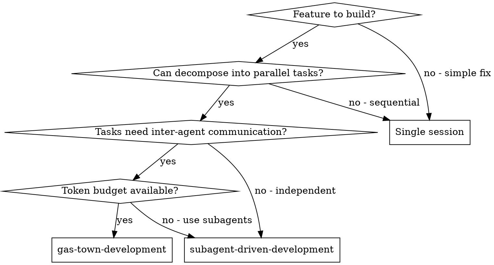
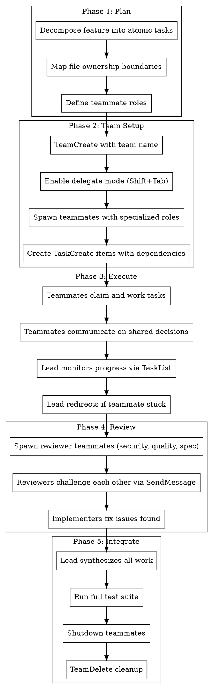

# Gas Town Development

## Overview

Orchestrate Claude Code **agent teams** with specialized roles, atomic tasks, file ownership, and multi-angle review for feature development. Adapted from Steve Yegge's Gas Town methodology.

**Core principle:** The lead delegates and orchestrates. Teammates own files, execute tasks, and communicate with each other. Work flows continuously - no agent should idle waiting for instructions.

**Agent teams vs subagents:** This skill uses agent teams (TeamCreate, SendMessage), NOT subagents (Task tool). Agent teams have their own context windows and can message each other directly. Use `dispatching-parallel-agents` or `subagent-driven-development` for subagent workflows instead.

## When to Use



**Use when:**
- 3+ files/modules need parallel changes
- Teammates would benefit from discussing findings (architecture decisions, API contracts)
- Multi-perspective review catches more than single reviewer
- Building a substantial feature (new endpoint + frontend + tests)

**Don't use when:**
- Simple bug fix or single-file change
- All tasks are strictly sequential (each depends on previous)
- Tasks are fully independent with no coordination needed (use subagents instead)
- Token budget is constrained (agent teams cost significantly more)

## Gas Town Principles Mapped to Claude Code

| Gas Town Concept | Claude Code Implementation |
|---|---|
| **GUPP** (continuous execution) | Create 5-6 tasks per teammate so they always have queued work |
| **Specialized roles** (Mayor, Polecats, Refinery) | Named teammates with specific responsibilities |
| **Delegate-first leadership** | Use delegate mode (Shift+Tab) - lead orchestrates only |
| **Atomic work units** (Molecules/Beads) | Right-sized TaskCreate items with clear deliverables |
| **File ownership** | Each teammate owns a disjoint set of files |
| **Rule of Five** (multi-pass review) | Reviewer teammates with different focus areas |
| **NDI** (nondeterministic idempotence) | Teammates commit after each task; work survives crashes |
| **Convoys** (inception to completion) | Structured phases: Plan, Setup, Execute, Review, Integrate |

## The Workflow



## Phase 1: Plan Before Spawning

**Do this BEFORE creating the team.** Planning in your head is free; spawning teammates that sit idle burns tokens.

### Task Decomposition

Break the feature into tasks that are:
- **Atomic:** One clear deliverable (a file, a function, a test suite)
- **Owned:** One teammate is responsible, no shared files
- **Testable:** Has a verification step (test passes, endpoint responds, UI renders)

```
Feature: Add user authentication

Tasks:
1. Auth middleware (src/middleware/auth.ts) - Teammate: backend
2. User model + migration (src/models/user.ts, migrations/) - Teammate: backend
3. Login/register endpoints (src/routes/auth.ts) - Teammate: backend
4. Auth context + hooks (src/hooks/useAuth.ts) - Teammate: frontend
5. Login page component (src/pages/Login.tsx) - Teammate: frontend
6. Protected route wrapper (src/components/ProtectedRoute.tsx) - Teammate: frontend
7. Integration tests (tests/auth.test.ts) - Teammate: tester
8. E2E tests (tests/e2e/auth.spec.ts) - Teammate: tester

Dependencies: 1,2 before 3. 3 before 7. 4 before 5,6. 5,6 before 8.
```

### File Ownership Mapping

**Critical: Two teammates must NEVER edit the same file.** This is the #1 source of lost work with agent teams.

Draw ownership boundaries:
- Group files by module/layer
- Assign each group to exactly one teammate
- Shared types/interfaces go to whoever creates them first; others import

### Role Definition

Don't use generic names. Define what each teammate does:

| Role | Responsibility | Owns |
|---|---|---|
| `backend` | API layer, middleware, models | `src/middleware/`, `src/models/`, `src/routes/` |
| `frontend` | UI components, hooks, pages | `src/components/`, `src/hooks/`, `src/pages/` |
| `tester` | Integration + E2E tests | `tests/` |
| `security-reviewer` | Review for vulnerabilities | Read-only, reviews all |
| `quality-reviewer` | Code quality, patterns | Read-only, reviews all |

## Phase 2: Team Setup

### Create the Team

```
Create an agent team called "auth-feature" for implementing user authentication.
Use delegate mode - I will only orchestrate, not implement.
```

After team creation, press **Shift+Tab** to enable delegate mode. This prevents the lead from implementing tasks itself.

### Spawn Teammates with Context

Each teammate needs enough context to work independently. Include:
- What they own (specific files/directories)
- What they must NOT touch
- API contracts they need to follow
- How to verify their work

```
Spawn a teammate named "backend" with this prompt:

You are implementing the backend authentication layer.
You OWN: src/middleware/, src/models/, src/routes/auth.ts
You must NOT edit: src/components/, src/hooks/, src/pages/, tests/

API contract (frontend will consume):
- POST /api/auth/register { email, password } -> { token, user }
- POST /api/auth/login { email, password } -> { token, user }
- GET /api/auth/me (Authorization: Bearer <token>) -> { user }

Use JWT tokens. Hash passwords with bcrypt. Commit after each task.
Require plan approval before making changes.
```

### Require Plan Approval

For implementation teammates, **always require plan approval**. The lead reviews the approach before any code is written:

```
Spawn teammates with plan approval required.
Only approve plans that include test verification steps.
Reject plans that modify files outside the teammate's ownership.
```

### Create Tasks with Dependencies

After spawning, create the full task list with dependencies:

```
Create these tasks for the auth-feature team:

1. "Create User model and migration" - assigned to backend
2. "Implement auth middleware with JWT verification" - assigned to backend
3. "Build login and register endpoints" - assigned to backend, blocked by 1 and 2
4. "Create useAuth hook and AuthContext" - assigned to frontend
5. "Build Login page component" - assigned to frontend, blocked by 4
6. "Build ProtectedRoute wrapper" - assigned to frontend, blocked by 4
7. "Write integration tests for auth endpoints" - assigned to tester, blocked by 3
8. "Write E2E tests for auth flow" - assigned to tester, blocked by 5, 6, and 7
```

**GUPP principle:** Create 5-6 tasks per teammate so they always have queued work. If a teammate finishes their current task and nothing is available, they'll idle and burn tokens waiting.

## Phase 3: Execute

### Monitor, Don't Micromanage

Check TaskList periodically. Intervene only when:
- A teammate is stuck (idle too long, asking questions to nobody)
- File ownership is about to be violated
- A dependency is blocking progress

```
Check on the backend teammate's progress.
If they're stuck on the JWT implementation, suggest using jsonwebtoken library.
```

### Facilitate Inter-Teammate Communication

When teammates need to coordinate (e.g., agreeing on an API contract), tell them to message each other directly:

```
Tell the backend teammate to message the frontend teammate
with the final API response shapes so frontend can type them correctly.
```

### Git Discipline

**Every completed task = a commit.** This is Gas Town's NDI principle - work survives crashes, context limits, and session restarts.

Tell teammates in their spawn prompt:
```
After completing each task, commit your changes with a descriptive message.
Do not batch multiple tasks into one commit.
```

## Phase 4: Review

### Spawn Reviewer Teammates

After implementation tasks complete, spawn review-focused teammates. Each reviewer applies a different lens (Gas Town's Rule of Five):

```
Spawn three reviewer teammates:

1. "security-reviewer": Review all auth code for security vulnerabilities.
   Focus on: token handling, password hashing, input validation,
   SQL injection, session management. Report severity ratings.

2. "quality-reviewer": Review code quality across all changes.
   Focus on: error handling, type safety, code duplication,
   naming conventions, separation of concerns.

3. "spec-reviewer": Verify implementation matches requirements.
   Check: all endpoints exist, response shapes match contract,
   error cases handled, edge cases covered.
```

### Adversarial Review

The power of agent teams over subagents is that reviewers can **challenge each other**:

```
Have the reviewers share their findings with each other.
If one reviewer disagrees with another's assessment, they should
debate it and reach consensus. The security reviewer should
challenge any "acceptable risk" claims from the quality reviewer.
```

### Fix Loop

When reviewers find issues, route fixes back to the owning implementer:

```
The security reviewer found issues in the auth middleware.
Create a task for the backend teammate to fix these issues.
After fixing, have the security reviewer re-review.
```

## Phase 5: Integrate

### Synthesize

The lead collects all findings and creates a summary:

```
Summarize all reviewer findings and the current state of fixes.
Are there any outstanding issues? Is the feature ready for merge?
```

### Final Verification

```
Run the full test suite to verify all changes work together.
Check for any file conflicts between teammates' commits.
```

### Clean Shutdown

Always clean up properly:

```
1. Ask each teammate to shut down gracefully
2. Wait for all shutdowns to complete
3. Clean up the team (TeamDelete)
```

**Never skip cleanup.** Orphaned teammates continue consuming resources.

## Team Composition Patterns

### Feature Development (most common)

```
Lead (delegate mode)
  backend     - API, models, middleware
  frontend    - UI components, hooks, pages
  tester      - Integration + E2E tests
  [reviewers spawned after implementation]
```

### Debugging with Competing Hypotheses

```
Lead (delegate mode)
  investigator-1  - Theory: race condition in auth
  investigator-2  - Theory: token expiry logic
  investigator-3  - Theory: middleware ordering
  [investigators message each other to challenge theories]
```

### Code Review

```
Lead (delegate mode)
  security-reviewer  - OWASP, injection, auth
  perf-reviewer      - N+1 queries, bundle size, caching
  test-reviewer      - Coverage, edge cases, flaky tests
  [reviewers share and debate findings]
```

## Task Sizing Guide

| Size | Example | Right? |
|---|---|---|
| Too small | "Rename variable" | No - coordination overhead exceeds benefit |
| Too small | "Add one import" | No - not worth a task |
| Right size | "Implement login endpoint with validation" | Yes - clear deliverable, testable |
| Right size | "Create auth middleware with JWT verification" | Yes - self-contained module |
| Too large | "Implement entire authentication system" | No - should be 5+ tasks |
| Too large | "Build the frontend" | No - too vague, no clear completion |

**Rule of thumb:** A task should take a teammate 1-3 tool-call cycles to complete. If it needs 10+ cycles, split it.

## Common Mistakes

**Lead implements instead of delegating:**
Use delegate mode (Shift+Tab) immediately after team creation. If you catch the lead coding, tell it: "Wait for your teammates to complete their tasks before proceeding."

**File conflicts between teammates:**
Two teammates editing the same file = lost work. Define ownership in Phase 1 and include it in every teammate's spawn prompt.

**Not enough tasks queued (violating GUPP):**
Teammates finish a task and idle. Create all tasks upfront with dependencies. Aim for 5-6 tasks per teammate.

**Generic teammate roles:**
"worker-1, worker-2, worker-3" gives teammates no identity or focus. Name them by what they do: "backend", "frontend", "tester".

**Skipping plan approval:**
Teammates start coding without review. Always require plan approval for implementation teammates. Review their approach before they write code.

**Reviewers working in isolation:**
A single reviewer misses what two reviewers debating would catch. Tell reviewers to share findings and challenge each other.

**No git commits between tasks:**
A crash or context limit wipes out uncommitted work. Every completed task = a commit.

**Forgetting team cleanup:**
Orphaned teammates and team resources persist. Always shutdown teammates then TeamDelete.

## Red Flags - STOP and Reassess

- Lead is writing implementation code (enable delegate mode)
- Two teammates are editing the same file (fix ownership)
- Teammate has been idle for multiple turns (assign work or check status)
- Reviewer approved without any findings (reviewers should always find something)
- Tasks have no dependencies defined (likely missing sequencing)
- Teammate spawn prompt doesn't mention file ownership (add it)
- More than 5 teammates spawned (coordination overhead exceeds benefit)
- No plan approval required (add it for implementation teammates)

## Quick Reference

| Action | How |
|---|---|
| Create team | Tell lead to create agent team with name |
| Enable delegate mode | Shift+Tab after team creation |
| Spawn teammate | Tell lead to spawn with name, role, prompt |
| Require plan approval | Include in spawn instruction |
| Create task | Tell lead or use TaskCreate |
| Set dependency | Use TaskUpdate with addBlockedBy |
| Message teammate | Tell lead, or Shift+Up/Down to select |
| Check progress | TaskList or ask lead |
| Shutdown teammate | Tell lead to send shutdown request |
| Clean up | Shutdown all teammates, then TeamDelete |

## Integration

**Prerequisite:**
- Enable `CLAUDE_CODE_EXPERIMENTAL_AGENT_TEAMS` in settings.json

**Complementary skills:**
- **superpowers:writing-plans** - Create the plan before spawning the team
- **superpowers:test-driven-development** - Teammates should follow TDD
- **superpowers:verification-before-completion** - Verify before marking tasks complete
- **superpowers:finishing-a-development-branch** - After team completes, finish the branch

**Alternative approaches:**
- **superpowers:subagent-driven-development** - When tasks don't need inter-agent communication
- **superpowers:dispatching-parallel-agents** - When tasks are fully independent
