# Managing User Panel - Visual Workflow Diagram

**Version:** 1.0 | **Last Updated:** 2026-03-17

---

## Mermaid Flowchart

```mermaid
flowchart TD
    Start([User Says: 'user panel' / 'need participants']) --> P1_Intro[Phase 1: Introduction]

    P1_Intro --> P1_Select[Select Cross-Design Manager<br/>5 approvers + Other option]
    P1_Select --> Store1[Store: Approver name + Slack user ID]

    Store1 --> P2_Start[Phase 2: Brief Creation]

    %% Phase 2: 8 Questions
    P2_Start --> Q1[Q1: Requestor Details<br/>Name, Team, Date]
    Q1 --> Q2[Q2: Problem Statement & Hypothesis]

    Q2 --> Coach2{Coaching Check:<br/>User-centered?<br/>Specific?}
    Coach2 -->|Needs revision| Q2
    Coach2 -->|Good| Q3[Q3: Research Goals<br/>Features/flows to test]

    Q3 --> Q4[Q4: Key Research Questions<br/>3-5 questions]

    Q4 --> MomTest{Mom Test Review:<br/>Leading questions?<br/>Future intent?}
    MomTest -->|Flag issues| CoachQ4[Show: Rewrite as<br/>'How do you currently...']
    CoachQ4 --> ReviseQ4{Make Changes?}
    ReviseQ4 -->|Yes| Q4
    ReviseQ4 -->|No| Q5
    MomTest -->|All good| Q5[Q5: Methodology<br/>Interview/Usability/Concept]

    Q5 --> Q6[Q6: Session Details<br/>Duration, Tools]

    Q6 --> Val6{Validation:<br/>≥30 minutes?}
    Val6 -->|No| Warn6[⚠️ User Panel SOP:<br/>Minimum 30 mins]
    Warn6 --> Adjust6{Adjust to 30+?}
    Adjust6 -->|Yes| Q7
    Adjust6 -->|No - use cold calls| Exit1([Exit: Use cold calls instead])
    Val6 -->|Yes| Q7[Q7: Screener Questions<br/>Behavioral criteria]

    Q7 --> CoachQ7{Behavioral Check:<br/>Past behavior?<br/>Not hypothetical?}
    CoachQ7 -->|Flag future intent| ShowQ7[Show: Rewrite as<br/>'How often did you...']
    ShowQ7 --> ReviseQ7{Make Changes?}
    ReviseQ7 -->|Yes| Q7
    ReviseQ7 -->|No| Q8
    CoachQ7 -->|Good| Q8[Q8: Number of Participants]

    Q8 --> Val8{Validation:<br/>Within range?<br/>5-7 discovery<br/>5-8 usability<br/>8-12 concept}
    Val8 -->|Out of range| WarnQ8[⚠️ Show recommended range<br/>Explain saturation]
    WarnQ8 --> AdjustQ8{Adjust?}
    AdjustQ8 -->|Yes| Q8
    AdjustQ8 -->|No| P3_Start
    Val8 -->|In range| P3_Start[Phase 3: Quality Review]

    %% Phase 3: Quality Check
    P3_Start --> Review[Run 5 Criteria Check:<br/>1. Problem-first<br/>2. Discussion guide<br/>3. Screeners<br/>4. Sampling<br/>5. Outcome alignment]

    Review --> ReviewResult{Quality Score}
    ReviewResult -->|All ✅| P4_Start
    ReviewResult -->|Some ⚠️| ShowIssues[Show flagged issues<br/>+ suggestions]
    ShowIssues --> UserChoice{User Decision}
    UserChoice -->|Make Changes| IdentifyQ[Which section?<br/>Q2/Q4/Q7/Other]
    IdentifyQ --> Q2
    UserChoice -->|Submit Anyway| P4_Start[Phase 4: Approval Workflow]

    %% Check iteration count
    ShowIssues --> IterCheck{3+ iterations?}
    IterCheck -->|Yes| Coaching[⚠️ Offer:<br/>1. 15-min coaching<br/>2. Mom Test guide<br/>3. Submit as-is]
    Coaching --> UserChoice
    IterCheck -->|No| UserChoice

    %% Phase 4: Approval
    P4_Start --> GenDoc[Generate Google Doc<br/>7-section brief]
    GenDoc --> ShareDoc[Set permissions:<br/>'Anyone with link can view']
    ShareDoc --> GetLink[Get shareable link]

    GetLink --> SendDM[Send Slack DM to approver<br/>📋 Brief summary + link]
    SendDM --> WaitApproval{Monitor Thread}

    WaitApproval -->|✅ Approved| P5_Start
    WaitApproval -->|💬 Changes requested| ShowFeedback[Show feedback to user]
    ShowFeedback --> IdentifySection[Which section needs update?]
    IdentifySection --> Q2

    WaitApproval -->|No response 24h| Remind{User choice}
    Remind -->|Send reminder| SendDM
    Remind -->|Escalate| EscalateSlack[DM to AD Research:<br/>Pingal or Varghese]
    EscalateSlack --> WaitApproval
    Remind -->|Wait longer| WaitApproval

    %% Phase 5: Logging
    P5_Start[Phase 5: Logging & Notification]
    P5_Start --> LogSheet[Append to Tracking Sheet<br/>7 columns: Date, Designer,<br/>Study type, Problem, N,<br/>Status, Link]

    LogSheet --> SheetError{Write success?}
    SheetError -->|Permission denied| Fallback[Fallback: Send details<br/>to Saurav via Slack<br/>for manual logging]
    SheetError -->|Success| ConfirmLog[✅ Confirm row # to user]
    Fallback --> SendStatus
    ConfirmLog --> SendStatus

    SendStatus[Send Status Summary<br/>to Saurav Rastogi<br/>🎯 Study details +<br/>screener + agency POC]

    SendStatus --> FinalConfirm[✅ Confirm to user:<br/>Next steps, timeline,<br/>preparation tips]

    FinalConfirm --> Done([Workflow Complete])

    %% Styling
    classDef phaseStyle fill:#e1f5ff,stroke:#0066cc,stroke-width:2px
    classDef questionStyle fill:#fff4e6,stroke:#ff9800,stroke-width:1px
    classDef validationStyle fill:#fff3cd,stroke:#ffc107,stroke-width:2px
    classDef actionStyle fill:#e8f5e9,stroke:#4caf50,stroke-width:1px
    classDef errorStyle fill:#ffebee,stroke:#f44336,stroke-width:2px

    class P1_Intro,P2_Start,P3_Start,P4_Start,P5_Start phaseStyle
    class Q1,Q2,Q3,Q4,Q5,Q6,Q7,Q8 questionStyle
    class Coach2,MomTest,Val6,Val8,CoachQ7,ReviewResult,WaitApproval,SheetError validationStyle
    class GenDoc,ShareDoc,SendDM,LogSheet,SendStatus actionStyle
    class Warn6,WarnQ8,ShowIssues,Coaching,Fallback errorStyle
```



---

## Detailed ASCII Flowchart

```
┌─────────────────────────────────────────────────────────────────┐
│  USER TRIGGER: "user panel" / "need participants" / /user-panel │
└────────────────────────────┬────────────────────────────────────┘
                             │
                             ▼
╔═══════════════════════════════════════════════════════════════╗
║                    PHASE 1: INTRODUCTION                       ║
╠═══════════════════════════════════════════════════════════════╣
║  1. Greet user (10-15 min workflow)                           ║
║  2. Ask: "Who should approve this research brief?"            ║
║     • Soni (U33LQ5Q2X)                                        ║
║     • Ankit Punia (U06LJR20NQJ)                               ║
║     • Pingal Kakati (UBGQDHJV7)                               ║
║     • Varghese Mathew (U09P6MDLGPK)                           ║
║     • Abhinav Krishna (U013WFYJEUT)                           ║
║     • Other (specify)                                         ║
║                                                               ║
║  STORE: approver_name, approver_slack_id                      ║
╚═══════════════════════════════════════════════════════════════╝
                             │
                             ▼
╔═══════════════════════════════════════════════════════════════╗
║              PHASE 2: BRIEF CREATION (8 QUESTIONS)             ║
╠═══════════════════════════════════════════════════════════════╣
║                                                               ║
║  ┌─────────────────────────────────────────────┐             ║
║  │  Q1: Requestor Details                      │             ║
║  │  • Name, Team, Date (auto-fill)             │             ║
║  └──────────────────┬──────────────────────────┘             ║
║                     │                                         ║
║  ┌──────────────────▼──────────────────────────┐             ║
║  │  Q2: Problem Statement & Hypothesis         │             ║
║  │  • User-centered problem                    │             ║
║  │  • Core assumption                          │             ║
║  └──────────────────┬──────────────────────────┘             ║
║                     │                                         ║
║           ┌─────────▼─────────┐                              ║
║           │ COACHING CHECK:   │                              ║
║           │ User-centered?    │                              ║
║           │ Specific?         │                              ║
║           │ Observable?       │                              ║
║           └─────────┬─────────┘                              ║
║                     │                                         ║
║      ⚠️ Needs revision? ──┐                                  ║
║                     │      │                                  ║
║                 ✅ Good    │                                  ║
║                     │      │                                  ║
║  ┌──────────────────▼──────┼──────────────────┐              ║
║  │  Q3: Research Goals & Areas of Inquiry     │              ║
║  │  • Features to show/test                   │              ║
║  │  • Flows to validate                       │              ║
║  └──────────────────┬────────────────────────┘               ║
║                     │                                         ║
║  ┌──────────────────▼──────────────────────────┐             ║
║  │  Q4: Key Research Questions (3-5)           │             ║
║  │  • How/Why questions                        │             ║
║  │  • Not "Would you..." questions             │             ║
║  └──────────────────┬──────────────────────────┘             ║
║                     │                                         ║
║           ┌─────────▼─────────────┐                          ║
║           │ MOM TEST REVIEW:      │                          ║
║           │ • Leading questions?  │                          ║
║           │ • Future intent?      │                          ║
║           │ • Hypotheticals?      │                          ║
║           └─────────┬─────────────┘                          ║
║                     │                                         ║
║         ⚠️ Flag issues ──┐                                   ║
║             │            │                                    ║
║         ✅ Good          │                                    ║
║             │            │                                    ║
║             │     ┌──────▼────────────────────┐              ║
║             │     │ Show rewrites:            │              ║
║             │     │ "How do you currently..." │              ║
║             │     │ "Last time you did..."    │              ║
║             │     └──────┬────────────────────┘              ║
║             │            │                                    ║
║             │     [Make Changes?] ──Yes──┐                   ║
║             │            │                │                   ║
║             │           No                │                   ║
║  ┌──────────▼────────────▼────────────────┼──────────┐       ║
║  │  Q5: Proposed Methodology               │          │       ║
║  │  • Moderated Usability Test             │          │       ║
║  │  • Discovery Interview                  │          │       ║
║  │  • Concept Test                         │          │       ║
║  │  • Diary Study / Other                  │          │       ║
║  └──────────────────┬──────────────────────┘          │       ║
║                     │                                  │       ║
║  ┌──────────────────▼──────────────────────┐          │       ║
║  │  Q6: Session Details                    │          │       ║
║  │  • Duration (min 30 mins)               │          │       ║
║  │  • Tools (Meet, Figma link)             │          │       ║
║  └──────────────────┬──────────────────────┘          │       ║
║                     │                                  │       ║
║           ┌─────────▼────────────┐                    │       ║
║           │ VALIDATION:          │                    │       ║
║           │ Duration ≥ 30 mins?  │                    │       ║
║           └─────────┬────────────┘                    │       ║
║                     │                                  │       ║
║             ❌ No (< 30 mins)                          │       ║
║                     │                                  │       ║
║         ┌───────────▼─────────────────┐               │       ║
║         │ ⚠️ User Panel SOP requires   │               │       ║
║         │    minimum 30 minutes.       │               │       ║
║         │    Adjust to 30+?            │               │       ║
║         └───────────┬─────────────────┘               │       ║
║                     │                                  │       ║
║           Yes ──────┼───────┐                         │       ║
║                     │       │                          │       ║
║             No (use cold    │                          │       ║
║             calls instead)  │                          │       ║
║                     │       │                          │       ║
║              ┌──────▼───┐   │                          │       ║
║              │   EXIT   │   │                          │       ║
║              │ workflow │   │                          │       ║
║              └──────────┘   │                          │       ║
║                             │                          │       ║
║             ✅ Yes (≥30)    │                          │       ║
║  ┌──────────────────────────▼──┼──────────────┐       │       ║
║  │  Q7: Participant Screener   │ Questions    │       │       ║
║  │  • Behavioral criteria      │              │       │       ║
║  │  • Past actions, not intent │              │       │       ║
║  └──────────────────┬───────────┘              │       │       ║
║                     │                          │       │       ║
║           ┌─────────▼─────────────┐            │       │       ║
║           │ BEHAVIORAL CHECK:     │            │       │       ║
║           │ • Past behavior?      │            │       │       ║
║           │ • Not hypothetical?   │            │       │       ║
║           └─────────┬─────────────┘            │       │       ║
║                     │                          │       │       ║
║         ⚠️ Flag future intent ──┐              │       │       ║
║             │                   │              │       │       ║
║         ✅ Good                 │              │       │       ║
║             │                   │              │       │       ║
║             │     ┌─────────────▼────────┐    │       │       ║
║             │     │ Show rewrites:       │    │       │       ║
║             │     │ "How often did you..."│   │       │       ║
║             │     │ "Last 30 days..."    │    │       │       ║
║             │     └─────────────┬────────┘    │       │       ║
║             │                   │              │       │       ║
║             │        [Make Changes?] ──Yes────┼───────┘       ║
║             │                   │              │               ║
║             │                  No              │               ║
║  ┌──────────▼───────────────────▼──────────────┘               ║
║  │  Q8: Number of Participants                                ║
║  │  • Recommended: 5-7 discovery                              ║
║  │                 5-8 usability                              ║
║  │                 8-12 concept                               ║
║  └──────────────────┬─────────────────────────────────────────║
║                     │                                          ║
║           ┌─────────▼──────────┐                              ║
║           │ VALIDATION:        │                              ║
║           │ Within range?      │                              ║
║           └─────────┬──────────┘                              ║
║                     │                                          ║
║       ⚠️ Out of range ──┐                                     ║
║             │           │                                      ║
║       ✅ In range       │                                      ║
║             │           │                                      ║
║             │   ┌───────▼──────────────────┐                  ║
║             │   │ ⚠️ Show recommended range │                  ║
║             │   │    Explain saturation     │                  ║
║             │   │    [Adjust?]              │                  ║
║             │   └───────┬──────────────────┘                  ║
║             │           │                                      ║
║             │     Yes ──┼──┐                                  ║
║             │           │  │                                   ║
║             │          No  │                                   ║
║             │           │  │                                   ║
╚═════════════╪═══════════╪══╪═══════════════════════════════════╝
              │           │  │
              ▼           ▼  │
╔═════════════════════════════════════════════════════════════╗ │
║            PHASE 3: RESEARCH QUALITY REVIEW                  ║ │
╠═════════════════════════════════════════════════════════════╣ │
║                                                              ║ │
║  Run 5 Criteria Check:                                      ║ │
║  ┌────────────────────────────────────────────────┐         ║ │
║  │ 1. Problem-First Analysis                      │         ║ │
║  │    ✅ User-centered, ⚠️ Solution-first           │         ║ │
║  │                                                 │         ║ │
║  │ 2. Discussion Guide Quality                    │         ║ │
║  │    ⚠️ Leading questions, ✅ Open-ended          │         ║ │
║  │                                                 │         ║ │
║  │ 3. Screener Questions                          │         ║ │
║  │    ⚠️ Future intent, ✅ Past behavior           │         ║ │
║  │                                                 │         ║ │
║  │ 4. Sampling Strategy                           │         ║ │
║  │    ⚠️ Too small/large, ✅ Optimal range         │         ║ │
║  │                                                 │         ║ │
║  │ 5. Outcome-Question Alignment                  │         ║ │
║  │    ⚠️ Missing critical Q's, ✅ Well-aligned     │         ║ │
║  └────────────────────────────────────────────────┘         ║ │
║                                                              ║ │
║  Generate Quality Report:                                   ║ │
║  "Overall: X/5 areas strong. Y areas need improvement."     ║ │
║                                                              ║ │
║           ┌──────────────────────┐                          ║ │
║           │  Quality Score?      │                          ║ │
║           └──────────┬───────────┘                          ║ │
║                      │                                       ║ │
║            All ✅ ───┼──────────────┐                        ║ │
║                      │              │                        ║ │
║            Some ⚠️   │              │                        ║ │
║                      │              │                        ║ │
║         ┌────────────▼──────┐       │                        ║ │
║         │ Show flagged      │       │                        ║ │
║         │ issues +          │       │                        ║ │
║         │ suggestions       │       │                        ║ │
║         └────────────┬──────┘       │                        ║ │
║                      │              │                        ║ │
║         ┌────────────▼──────────┐   │                        ║ │
║         │ Iteration count?     │   │                        ║ │
║         │ (Track: 1, 2, 3+)    │   │                        ║ │
║         └────────────┬──────────┘   │                        ║ │
║                      │              │                        ║ │
║          3+ iterations?             │                        ║ │
║                      │              │                        ║ │
║              Yes ────┼───┐          │                        ║ │
║                      │   │          │                        ║ │
║              No      │   │          │                        ║ │
║                      │   │          │                        ║ │
║                      │   │          │                        ║ │
║         ┌────────────▼───▼──────────┐                        ║ │
║         │ [Make Suggested Changes] │                        ║ │
║         │ [Submit for Approval]    │                        ║ │
║         └────────────┬──────────────┘                        ║ │
║                      │                                       ║ │
║          Make Changes│                                       ║ │
║         (identify    │                                       ║ │
║          which Q) ───┼─────────────────────────────────────┐║ │
║                      │                                      │║ │
║   [If 3+ iter] ──┐   │                                      │║ │
║                  │   │                                      │║ │
║   ┌──────────────▼───┴─┐                                   │║ │
║   │ ⚠️ Offer:           │                                   │║ │
║   │ 1. 15-min coaching  │                                   │║ │
║   │ 2. Mom Test guide   │                                   │║ │
║   │ 3. Submit as-is     │                                   │║ │
║   └─────────────────────┘                                   │║ │
║                                                              ║ │
╚══════════════════════════════════════════════════════════════╝ │
              │                                                  │
              │ Submit for Approval                              │
              ▼                                                  │
╔═════════════════════════════════════════════════════════════╗ │
║               PHASE 4: APPROVAL WORKFLOW                     ║ │
╠═════════════════════════════════════════════════════════════╣ │
║                                                              ║ │
║  Step 1: Generate Google Doc                                ║ │
║  ┌────────────────────────────────────────────┐             ║ │
║  │ User Panel Request Brief                   │             ║ │
║  │                                             │             ║ │
║  │ 1. Problem Statement & Hypothesis          │             ║ │
║  │ 2. Research Goals & Areas of Inquiry       │             ║ │
║  │ 3. Key Research Questions                  │             ║ │
║  │ 4. Proposed Methodology                    │             ║ │
║  │ 5. Session Details                         │             ║ │
║  │ 6. Participant Screener Questions          │             ║ │
║  │ 7. Number of Participants Required         │             ║ │
║  └────────────────────────────────────────────┘             ║ │
║                      │                                       ║ │
║  Step 2: Share Doc & Get Link                               ║ │
║  • Permissions: "Anyone with link can view"                 ║ │
║  • Store: doc_shareable_link                                ║ │
║                      │                                       ║ │
║  Step 3: Send Slack DM to Approver                          ║ │
║  ┌────────────────────────────────────────────┐             ║ │
║  │ 📋 New User Panel Request                  │             ║ │
║  │                                             │             ║ │
║  │ From: [Designer]                           │             ║ │
║  │ Study: [Problem - 80 chars]                │             ║ │
║  │ Participants: [N users]                    │             ║ │
║  │ Duration: [X mins]                         │             ║ │
║  │                                             │             ║ │
║  │ 📄 Full Brief: [Google Doc link]           │             ║ │
║  │                                             │             ║ │
║  │ Please review:                              │             ║ │
║  │ ✅ Approve                                  │             ║ │
║  │ 💬 Request Changes                          │             ║ │
║  └────────────────────────────────────────────┘             ║ │
║                      │                                       ║ │
║  Step 4: Wait for Approval (Monitor Thread)                 ║ │
║           ┌──────────┴────────────┐                         ║ │
║           │                       │                          ║ │
║      ✅ Approved          💬 Changes Requested               ║ │
║           │                       │                          ║ │
║           │              ┌────────▼────────┐                 ║ │
║           │              │ Show feedback   │                 ║ │
║           │              │ Which section?  │                 ║ │
║           │              │ Re-ask Q → Retry│                 ║ │
║           │              └────────┬────────┘                 ║ │
║           │                       │                          ║ │
║           │                       └──────────────────────────┼─┘
║           │                                                  ║
║           │          ⏰ No response in 24h                   ║
║           │                       │                          ║
║           │              ┌────────▼────────────┐             ║
║           │              │ User Choice:        │             ║
║           │              │ • Send reminder     │             ║
║           │              │ • Escalate to AD    │             ║
║           │              │ • Wait longer       │             ║
║           │              └────────┬────────────┘             ║
║           │                       │                          ║
║           │           [Send reminder] ──┐                    ║
║           │                       │     │                    ║
║           │        [Escalate] ────┼───┐ │                    ║
║           │                       │   │ │                    ║
║           │        [Wait] ────────┼───┼─┘                    ║
║           │                       │   │                      ║
║           │                       │   └─> DM to Pingal/      ║
║           │                       │        Varghese          ║
║           │                       │                          ║
╚═══════════╪═══════════════════════╪══════════════════════════╝
            │                       │
            │ (loops back to monitor)
            │
            ▼
╔═══════════════════════════════════════════════════════════════╗
║          PHASE 5: STUDY LOGGING & STATUS NOTIFICATION         ║
╠═══════════════════════════════════════════════════════════════╣
║                                                               ║
║  Step 1: Log to Tracking Sheet                               ║
║  Sheet: 1UzZ5A2adJ3OrOCjme6D87jbxtNQZoKJBp_aTkxLjOro          ║
║                                                               ║
║  Append new row:                                             ║
║  ┌───────────────────────────────────────────────┐           ║
║  │ A: Date (DD-MMM-YYYY)                         │           ║
║  │ B: Designer name                              │           ║
║  │ C: Study type (methodology)                   │           ║
║  │ D: Problem statement (100 chars)              │           ║
║  │ E: No. of participants                        │           ║
║  │ F: Status ("Pending Scheduling")              │           ║
║  │ G: Brief link (Google Doc)                    │           ║
║  └───────────────────────────────────────────────┘           ║
║                      │                                        ║
║           ┌──────────▼──────────┐                            ║
║           │ Write success?      │                            ║
║           └──────────┬──────────┘                            ║
║                      │                                        ║
║        ✅ Success ───┼──────────┐                             ║
║                      │          │                             ║
║        ❌ Permission denied      │                             ║
║                      │          │                             ║
║         ┌────────────▼──────┐   │                             ║
║         │ FALLBACK:         │   │                             ║
║         │ Send details to   │   │                             ║
║         │ Saurav via Slack  │   │                             ║
║         │ for manual log    │   │                             ║
║         └────────────┬──────┘   │                             ║
║                      │          │                             ║
║                      │   ┌──────▼──────┐                      ║
║                      │   │ ✅ Confirm:  │                      ║
║                      │   │ Row #[N]     │                      ║
║                      │   └──────┬──────┘                      ║
║                      │          │                             ║
║  Step 2: Send Status Summary to Saurav                       ║
║  ┌──────────────────────────────────────┐                    ║
║  │ 🎯 User Panel Study Approved & Logged│                    ║
║  │                                       │                    ║
║  │ Designer: [Name] ([Team])            │                    ║
║  │ Study: [Problem statement]           │                    ║
║  │ Methodology: [Type]                  │                    ║
║  │ Participants: [N users]              │                    ║
║  │ Duration: [X mins]                   │                    ║
║  │                                       │                    ║
║  │ Screener Criteria:                   │                    ║
║  │ [Key criteria]                       │                    ║
║  │                                       │                    ║
║  │ 📄 Full Brief: [link]                │                    ║
║  │ 📊 Tracker: Row #[N] - [sheet link]  │                    ║
║  │                                       │                    ║
║  │ Next Step: Coordinate with panel     │                    ║
║  │ agency (2-3 days turnaround)         │                    ║
║  │                                       │                    ║
║  │ Agency POC:                          │                    ║
║  │ Phone: 8002734762 (Primary)          │                    ║
║  │ Escalation: 8149001986               │                    ║
║  └──────────────────────────────────────┘                    ║
║                      │                                        ║
║  Final Confirmation to User:                                 ║
║  ┌──────────────────────────────────────┐                    ║
║  │ ✅ All set! Next steps:              │                    ║
║  │                                       │                    ║
║  │ 1. Coordination team will email      │                    ║
║  │    panel agency                      │                    ║
║  │ 2. Expect scheduling in 2-3 days     │                    ║
║  │ 3. You'll get calendar invites       │                    ║
║  │                                       │                    ║
║  │ Prepare while waiting:                │                    ║
║  │ • Create Google Meet links           │                    ║
║  │ • Test prototype/materials           │                    ║
║  │ • Review discussion guide            │                    ║
║  └──────────────────────────────────────┘                    ║
║                                                               ║
╚═══════════════════════════════════════════════════════════════╝
                             │
                             ▼
                   ┌──────────────────┐
                   │ WORKFLOW COMPLETE │
                   └──────────────────┘
```

---

## Simplified Linear Flow (High-Level)

```
START
  │
  ├─> PHASE 1: Select Approver (2 min)
  │       └─> Store: approver_name, approver_slack_id
  │
  ├─> PHASE 2: Create Brief (10-15 min)
  │       ├─> Q1: Requestor
  │       ├─> Q2: Problem [+ Coaching]
  │       ├─> Q3: Goals
  │       ├─> Q4: Questions [+ Mom Test Review]
  │       ├─> Q5: Methodology
  │       ├─> Q6: Duration [+ Validation: ≥30 mins]
  │       ├─> Q7: Screeners [+ Behavioral Check]
  │       └─> Q8: Sample Size [+ Range Validation]
  │
  ├─> PHASE 3: Quality Review (2-3 min)
  │       └─> 5 Criteria → Flag issues → [Iterate or Approve]
  │
  ├─> PHASE 4: Approval (variable, <24h)
  │       ├─> Generate Google Doc
  │       ├─> Send Slack DM to approver
  │       └─> Wait for ✅ Approved or 💬 Changes
  │
  ├─> PHASE 5: Logging & Notification (2 min)
  │       ├─> Log to Tracking Sheet
  │       └─> Send Status Summary to Saurav
  │
COMPLETE
```

---

## Key Decision Points (Diamond Nodes)

| Decision Point | Location | Options | Loop Back To |
|----------------|----------|---------|--------------|
| **Q2 Coaching Check** | Phase 2, Q2 | Good / Needs revision | Q2 |
| **Q4 Mom Test Review** | Phase 2, Q4 | Good / Flag issues | Q4 |
| **Q6 Duration Validation** | Phase 2, Q6 | ≥30 mins / <30 mins | Q6 or Exit |
| **Q7 Behavioral Check** | Phase 2, Q7 | Good / Flag future intent | Q7 |
| **Q8 Sample Size** | Phase 2, Q8 | In range / Out of range | Q8 |
| **Quality Review** | Phase 3 | All ✅ / Some ⚠️ | Q2/Q4/Q7 |
| **3+ Iterations Check** | Phase 3 | Yes / No | Coaching offer |
| **Approval Response** | Phase 4 | ✅ / 💬 / ⏰ | Q2 or Phase 5 |
| **Sheet Write** | Phase 5 | Success / Permission denied | Fallback |

---

## Integration Points

```
┌─────────────────────────────────────────────────────────┐
│              EXTERNAL SYSTEM INTEGRATIONS                │
├─────────────────────────────────────────────────────────┤
│                                                          │
│  Google Workspace MCP:                                  │
│  • Create Doc (Phase 4, Step 1)                         │
│  • Share Doc (Phase 4, Step 2)                          │
│  • Append to Sheet (Phase 5, Step 1)                    │
│                                                          │
│  Slack MCP:                                             │
│  • Send DM to Approver (Phase 4, Step 3)                │
│  • Monitor Thread (Phase 4, Step 4)                     │
│  • Send DM to Saurav (Phase 5, Step 2)                  │
│  • Fallback logging (Phase 5, error)                    │
│                                                          │
│  HeyMarvin MCP (Optional):                              │
│  • Not used in core workflow                            │
│  • Can be referenced in coaching examples               │
│                                                          │
└─────────────────────────────────────────────────────────┘
```

---

## Version Info

**Diagram Version:** 1.0
**Last Updated:** 2026-03-17
**Synced with:** SKILL.md v1.0, WORKFLOW-STRUCTURE.md v1.0

---

**Rendering Instructions:**

1. **Mermaid Flowchart:** Copy the mermaid code block into any Mermaid-compatible viewer:
   - GitHub markdown preview
   - Mermaid Live Editor (https://mermaid.live)
   - VS Code with Mermaid extension
   - Notion, Confluence (with Mermaid plugins)

2. **ASCII Flowchart:** Best viewed in monospace font (Courier, Monaco, Consolas)

3. **Print/PDF:** Use the simplified linear flow for quick reference cards
